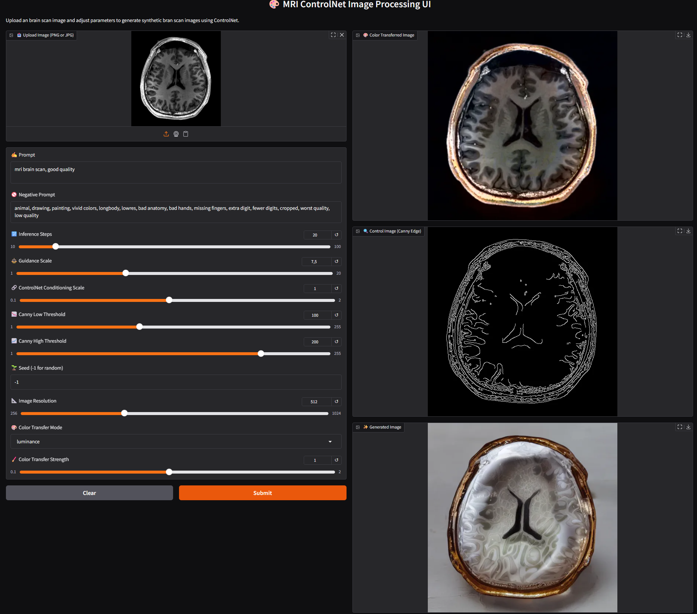

# MRI ControlNet Image Processing

This repository contains a frontend and backend implementation for processing MRI images using ControlNet. The frontend is built with Gradio, while the backend is powered by FastAPI.

## Features
- Upload MRI images and adjust parameters for image processing.
- Generate synthetic brain scan images using ControlNet.
- Apply color transfer modes to processed images.

## Example Gradio UI
Below is an example of the Gradio UI for the application:



## Prerequisites
- Docker and Docker Compose installed.
- Python 3.10 or higher installed.

## Installation

### Clone the Repository
```bash
git clone https://github.com/dprokhorov17/MriControlNet.git
cd MriControlNet
```

### Build and Deploy with Docker

1. Build the Docker images:
   ```bash
   docker compose build
   ```

2. Start the containers:
   ```bash
   docker compose up
   ```

3. Access the Gradio UI at `http://localhost:7860`.

### Manual Deployment (not recommended!)

#### Backend
1. Navigate to the backend directory:
   ```bash
   cd backend
   ```

2. Install dependencies:
   ```bash
   pip install -r requirements.txt
   ```

3. Start the FastAPI server:
   ```bash
   cd frontend
   python main.py
   ```

#### Frontend
1. Navigate to the frontend directory:
   ```bash
   cd frontend
   ```

2. Install dependencies:
   ```bash
   pip install -r requirements.txt
   ```

3. Start the Gradio UI:
   ```bash
   python gradio_ui.py
   ```

4. Access the Gradio UI at `http://localhost:7860`.

## Configuration
- The backend API URL can be configured using the `API_URL` environment variable. Default is `http://localhost:8000/process`.

### Environment Configuration

Create a `.env` file in the backend directory based on the provided `.env.example` file. This file contains configuration variables for the application.

#### Example `.env` File
```bash
APP_TITLE=ControlNet Image Processing API
APP_VERSION=1.0.0
DEFAULT_CONTROLNET_MODEL=lllyasviel/control_v11p_sd15_canny
DEFAULT_SD_MODEL=runwayml/stable-diffusion-v1-5
DEVICE=cuda
DEFAULT_IMAGE_RESOLUTION=768
DEFAULT_LOW_THRESHOLD=120
DEFAULT_HIGH_THRESHOLD=240
LOG_LEVEL=DEBUG
MAX_FILE_SIZE_MB=10
```

#### Instructions
1. Copy the `.env.example` file to `.env`:
   ```bash
   cp .env.example .env
   ```
2. Modify the values in the `.env` file as needed for your environment.

## Example Usage
1. Upload an MRI image.
2. Adjust parameters such as inference steps, guidance scale, and color transfer mode.
3. View the processed images including original, control, generated, and color-transferred versions.

## License
This project is licensed under the Apache License. See the LICENSE file for details.